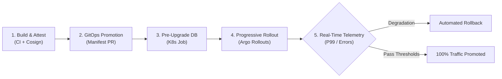

# Release Engineering & Progressive Delivery Standards

Production standards for continuous deployment, GitOps reconciliation, telemetry-driven canary promotions, decoupled database migrations, and cryptographic software supply chain integrity.

---

## Domain Overview

Modern release engineering decouples software deployment from feature release, transforming continuous delivery into an automated, deterministic, and safe progression. By combining pull-based GitOps synchronization, isolated schema migrations, keyless artifact attestation, and real-time metric analysis, systems achieve continuous deployment with zero downtime and bounded blast radius.

### Key Objectives

- **Zero Downtime**: Decouple database migrations from pod startup sequences to enable rolling schema evolution without service disruption.
- **Blast Radius Mitigation**: Incrementally shift production traffic (e.g., 5%, 25%, 50%, 100%) and abort instantly upon metric threshold violations.
- **Pull-Based Reconciliation**: Maintain Git as the single source of truth using in-cluster reconciliation engines with automated drift detection and self-healing.
- **Cryptographic Provenance**: Enforce keyless artifact signing, SLSA Level 3 attestations, and fail-closed admission controller verification.

---

## Standards Index

| Standard | Focus Area | Summary |
|---|---|---|
| [Progressive Delivery](./progressive-delivery.md) | Canary & Blue-Green Traffic Shifting | Argo Rollouts orchestration, stepped traffic increments, real-time Prometheus metric analysis, and instant automated rollback. |
| [GitOps Promotions](./gitops-promotions.md) | Pull-Based Reconciliation & Pipelines | Multi-repository GitOps topology, environment promotion pipelines, automated drift detection, and self-healing runtime state. |
| [Database Migrations](./database-migrations.md) | Schema Lifecycle & Zero Downtime | Decoupled migrations, Kubernetes pre-upgrade Jobs, dual-version backward compatibility, and elimination of application auto-migrations. |
| [Supply Chain Security](./supply-chain-security.md) | Artifact Integrity & Admission Gates | Keyless Cosign signing via OIDC, SLSA Level 3 provenance, automated vulnerability scanning gates, and Kyverno admission controls. |

---

## Progressive Release Lifecycle

---

## Core Delivery Gates

Production releases must pass four deterministic verification gates:

1. **Static Manifest Audit**: Manifests pass `deployment-validator --mode=static` prior to promotion PR merge.
2. **Cryptographic Attestation**: Container images carry Cosign signatures and SLSA provenance validated at admission.
3. **Decoupled Migration Run**: Schema changes complete successfully via standalone Kubernetes pre-upgrade Jobs.
4. **Telemetry Analysis**: Canary progression evaluates continuous metric thresholds (HTTP error rates < 0.1%, P99 latency within baseline).
