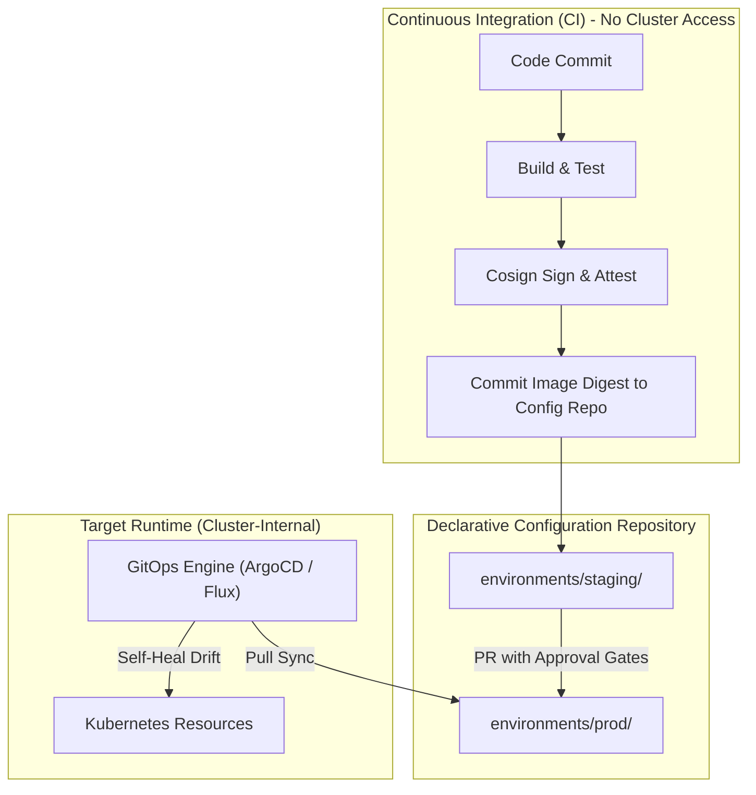
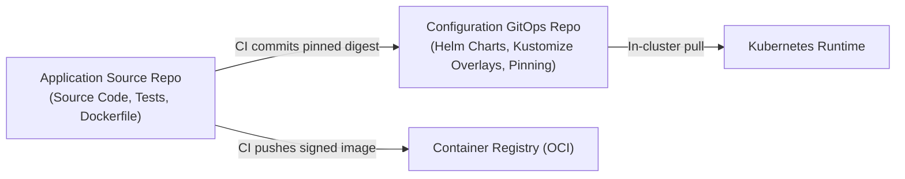

# GitOps Promotion Standards

Production standards for **pull-based reconciliation**, **multi-repository topology**, **environment promotions**, **drift detection**, and **automated self-healing** across cloud-native platforms.

---

## 1. Executive Summary & Purpose

Traditional continuous deployment models rely on "push-based" pipelines: external continuous integration (CI) runners authenticate directly against Kubernetes API servers using long-lived administrator credentials (`kubeconfig`). This model creates severe security exposure, introduces inconsistent cluster drift, and lacks an immutable audit trail for runtime configurations.

GitOps establishes Git as the single source of truth for declared infrastructure and application state. An in-cluster reconciliation agent continuously synchronizes target environments to match the state declared in version control.

This standard codifies mandatory practices for repository structuring, cross-environment promotion pipelines, automated self-healing, and zero-trust credential boundaries across all production environments.

---

## 2. Core Architectural Principles



### Pull-Based Reconciliation

All cluster state synchronizations must be pull-based. In-cluster agents (such as ArgoCD or Flux v2) monitor declared Git repositories and pull updates into the cluster. Inbound network ports to the Kubernetes API server must remain closed to external CI systems, eliminating ingress attack vectors.

### Zero Kubeconfig in CI Runners

Continuous integration runners must never possess cluster administrative credentials, service account tokens, or `kubeconfig` files. CI runners are limited to building artifacts, running tests, publishing signed container images, and writing configuration commits or Pull Requests to configuration repositories.

### Commit-Based Promotions

Every promotion between environments (development $\rightarrow$ staging $\rightarrow$ production) must be represented by an immutable Git commit. Ad-hoc cluster mutations, direct `kubectl apply` commands, and unversioned runtime edits are strictly prohibited. The Git commit log provides an auditable, cryptographically verifiable ledger of all historical deployments.

---

## 3. Repository Topologies & Boundaries

To preserve strict separation of concerns and fine-grained access control, organizations must decouple application source code from declarative deployment configurations.



### Decoupled Repository Pattern

1. **Application Source Repositories (`org/service-name`)**:
   - Contains application code, unit/integration tests, and build definitions (`Dockerfile`).
   - Software engineers retain write and merge permissions.
   - Pushes trigger CI builds, static code analysis, unit testing, and container publishing.

2. **Configuration / Manifest Repositories (`org/gitops-manifests`)**:
   - Contains declarative manifests (Helm charts, Kustomize overlays, or raw YAML).
   - Enforces branch protection: direct commits to production branches are blocked.
   - Governed by release engineering teams and designated service code owners.

### Configuration Repository Directory Structure

```text
gitops-manifests/
├── base/
│   ├── deployment.yaml
│   ├── service.yaml
│   ├── serviceaccount.yaml
│   └── kustomization.yaml
└── environments/
    ├── dev/
    │   ├── kustomization.yaml
    │   └── values.yaml
    ├── staging/
    │   ├── kustomization.yaml
    │   ├── patches/
    │   │   └── replicas.yaml
    │   └── values.yaml
    └── prod/
        ├── kustomization.yaml
        ├── patches/
        │   └── hpa.yaml
        └── values.yaml
```

---

## 4. Multi-Environment Promotion Workflows

Promotions must progress deterministically from lower environments to production through automated validation gates.

### Staging Promotion: Automated Digest Commits

Upon passing build and test suites in the application repository:

1. CI builds the container image and queries the immutable cryptographic digest (`sha256:...`).
2. The image is signed using Cosign keyless signing with GitHub Actions OIDC tokens.
3. CI runs static manifest scanning (`deployment-validator --mode=static`).
4. Upon passing all checks, CI creates an automated Git commit in the configuration repository updating the staging environment value (e.g., `image.digest: sha256:...`).
5. The in-cluster GitOps engine detects the staging commit and automatically reconciles the workload.

### Production Promotion: Pull Requests & Approval Gates

Direct automated commits to production configurations are strictly forbidden.

1. **Automated PR Generation**: A promotion bot or CI workflow opens a Pull Request modifying `environments/prod/` with the exact image digest proven in staging.
2. **Static CI Validation**: The PR triggers CI validation running `deployment-validator --mode=static` to verify that manifests comply with production security policies (e.g., non-root user, read-only root filesystem, CPU/memory limits, PodDisruptionBudget).
3. **Mandatory Approval Gates**:
   - Minimum of 2 approving peer reviews from designated repository code owners.
   - Verified pass of staging soak period (e.g., minimum 60 minutes in staging).
4. **Merge & Pull Reconciliation**: Merging the PR to the `main` branch triggers the GitOps engine to execute a progressive canary rollout in the production cluster.

---

## 5. State Reconciliation & Drift Detection

The GitOps engine must continuously verify that the live cluster matches the desired state declared in Git.

### Automated Self-Healing

The reconciliation controller must operate in automated self-healing mode:

- **Periodic Polling**: Git polling interval configured to $\le 3\text{ minutes}$, augmented by Git webhook push triggers for instant notification.
- **Drift Remediation**: If an engineer manually alters live cluster resources (e.g., via emergency `kubectl edit`), the engine must detect the configuration drift and overwrite the live resource back to declared Git state within 60 seconds.

### Automated Resource Pruning

The GitOps engine must enforce resource pruning (`prune: true`):

- When a Kubernetes manifest is deleted from Git, the engine must automatically delete the orphaned resource from the cluster.
- Prevents resource leakage, orphaned services, and configuration debt.

### Sync Waves & Dependency Phasing

Resource synchronization must adhere to strict ordering using sync waves to ensure prerequisites are running before dependent workloads schedule.

| Sync Wave | Resource Kinds | Purpose |
|---|---|---|
| **Wave -2** | Namespaces, CRDs | Cluster boundary and custom schema definitions |
| **Wave -1** | ServiceAccounts, Roles, RoleBindings | Identity and RBAC authorization |
| **Wave 0** | ConfigMaps, Secrets, SealedSecrets | Configuration dependencies and credentials |
| **Wave 1** | Pre-upgrade Database Migration Jobs | Schema migrations executed before new pods schedule |
| **Wave 2** | Workloads (`Deployment`, `Rollout`, `StatefulSet`) | Core application pods |
| **Wave 3** | Services, Ingress, VirtualServices, NetworkPolicies | Ingress exposure and network security boundaries |
| **Wave 4** | ServiceMonitors, PrometheusRules | Post-deployment observability monitors |

---

## 6. Reference Engine Implementations

Organizations may choose between ArgoCD and Flux v2. Both reference implementations must declare identical drift and pruning behaviors.

### Implementation 1: ArgoCD

ArgoCD manages application lifecycles via the `Application` custom resource:

```yaml
apiVersion: argoproj.io/v1alpha1
kind: Application
metadata:
  name: order-service-prod
  namespace: argocd
  finalizers:
    - resources-finalizer.argocd.argoproj.io
spec:
  project: default
  source:
    repoURL: https://github.com/org/gitops-manifests.git
    targetRevision: main
    path: environments/prod
  destination:
    server: https://kubernetes.default.svc
    namespace: production
  syncPolicy:
    automated:
      prune: true
      selfHeal: true
      allowEmpty: false
    syncOptions:
      - CreateNamespace=true
      - PrunePropagationPolicy=foreground
      - ApplyOutOfSyncOnly=true
    retry:
      limit: 5
      backoff:
        duration: 5s
        factor: 2
        maxDuration: 3m
```

### Implementation 2: Flux v2

Flux v2 coordinates synchronization through modular controllers (`source-controller`, `kustomize-controller`, and `helm-controller`):

```yaml
apiVersion: source.toolkit.fluxcd.io/v1
kind: GitRepository
metadata:
  name: gitops-manifests
  namespace: flux-system
spec:
  interval: 1m0s
  url: https://github.com/org/gitops-manifests.git
  ref:
    branch: main
---
apiVersion: kustomize.toolkit.fluxcd.io/v1
kind: Kustomization
metadata:
  name: order-service-prod
  namespace: flux-system
spec:
  interval: 5m0s
  path: ./environments/prod
  prune: true
  sourceRef:
    kind: GitRepository
    name: gitops-manifests
  healthChecks:
    - apiVersion: apps/v1
      kind: Deployment
      name: order-service
      namespace: production
  timeout: 3m0s
```

---

## 7. Governance, Security & Auditability

### Cryptographic Commit Signing

All automated and human commits to configuration repositories must carry cryptographic signatures:

- **Human Commits**: Signed via verified GPG or SSH keys registered with developer identities.
- **Machine Commits**: Signed via GitHub Actions bot GPG keys or machine commit tokens.
- Branch protection rules must enforce `Require signed commits`.

### Deterministic Rollbacks via Git Revert

When a production defect escapes progressive canary analysis, rollbacks must not be performed via manual `kubectl` interventions:

1. Identify the offending promotion commit SHA in the configuration repository.
2. Execute a standard git revert:

   ```bash
   git revert <commit-sha> -m "revert: rollback production to last known stable digest"
   git push origin main
   ```

3. The GitOps engine pulls the reverted commit and restores the previous image digest and manifest configuration within seconds.
4. The Git history preserves a full audit record of both the failed rollout and the subsequent remediation.

### Operational Anti-Patterns

| Anti-Pattern | Operational Risk | Standard Compliance |
|---|---|---|
| **Direct CI `kubectl apply`** | Cluster credentials leaked to CI; bypasses Git as source of truth. | Zero `kubeconfig` in CI runners; pull-based sync only. |
| **Combined Source & Config Repo** | Trigger loops, tangled permission models, unconstrained write access. | Strict multi-repo decoupling between app source and GitOps configs. |
| **Floating Tags (`:latest`)** | Non-deterministic deployments, inability to verify image signatures. | Mandatory immutable cryptographic digests (`@sha256:...`). |
| **Disabling Self-Healing** | Undetected drift between running cluster and Git repository. | Automated self-healing with active drift reconciliation required. |
