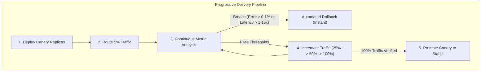
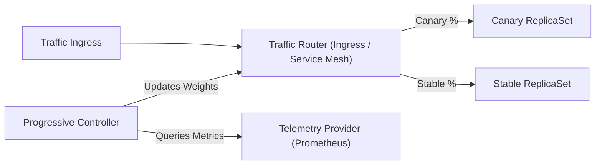

# Progressive Delivery Standard

Production standards for **progressive delivery**, **canary traffic shifting**, **telemetry-driven automated rollback**, and **blue-green deployments** across cloud-native environments.

---

## 1. Executive Summary & Purpose

Traditional monolithic deployments present unacceptable operational risk: a defect deployed to 100% of production traffic immediately impacts all users, exhausts error budgets, and demands high-stress manual triage.

Progressive delivery decouples code deployment from feature release. New versions are deployed to production infrastructure alongside existing stable versions, verified against real-world production traffic in controlled increments, and continuously validated against strict telemetry thresholds. If operational degradations emerge, the deployment controller executes a deterministic automated rollback with zero human intervention.

This standard establishes mandatory requirements for all Tier 1 and Tier 2 services running in cloud-native container orchestrators.

---

## 2. Core Architectural Principles



### Blast Radius Mitigation

Deployments must isolate potential failures to a strictly bounded subset of traffic. By initiating traffic exposure at low percentages (e.g., 5%), operational anomalies, uncaught runtime exceptions, and database performance regressions affect minimal user transactions before detection.

### Continuous Telemetry Evaluation

Human evaluation during deployments is prohibited for progression gates. Rollout controllers must query real-time production telemetry (Prometheus, Datadog, OpenTelemetry) at every progression step. Metric queries must execute continuously across active bake windows to establish statistical significance.

### Deterministic Rollback

Rollback mechanisms must be fully automated, instantaneous, and deterministic. If a telemetry evaluation breaches defined thresholds, the rollout controller immediately resets ingress routing to the stable replica set, halts further pod scheduling, and marks the rollout as degraded. No engineer intervention is required to initiate an abort.

---

## 3. Traffic Shifting & Progression Models

Progressive delivery engines must implement stepped traffic routing through an ingress controller, service mesh, or cloud load balancer.

### Canary Progression Steps & Bake Windows

All production canary rollouts must follow a four-tier stepped progression. Direct jumps from 0% to 100% are strictly prohibited for production environments.

| Progression Step | Traffic Allocation | Minimum Bake Duration | Primary Validation Objective |
|---|---|---|---|
| **Phase 1: Seed** | 5% | 10 minutes | Runtime initialization, panic detection, immediate crash loops |
| **Phase 2: Initial** | 25% | 15 minutes | Early throughput verification, downstream dependency capacity |
| **Phase 3: Half-Load** | 50% | 20 minutes | P95/P99 latency stability, connection pool saturation |
| **Phase 4: Full** | 100% | 15 minutes | Final verification before stable replica set decommissioning |

Total minimum bake duration for a complete production canary progression is **60 minutes**. Lower environments (development and staging) may compress bake windows to 2–5 minutes per step.

### Blue-Green Cutover Criteria

Blue-green deployments maintain two identical environments: active (`blue`) and preview (`green`). Blue-green is required when service workloads exhibit breaking state transitions, database schema lock sensitivity, or long-lived asynchronous batch jobs that cannot tolerate canary traffic splitting.

Cutover from preview to active must satisfy the following deterministic criteria:

1. **Synthetic Verification**: 100% of pre-cutover smoke tests against the preview endpoint pass.
2. **Readiness Parity**: 100% of preview pods report healthy readiness probes for a minimum of 180 seconds.
3. **Instantaneous Atomic Cutover**: Ingress or service selector updates atomically to route 100% of live traffic to the preview environment.
4. **Teardown Delay**: The retired stable environment must remain running in an idle state for a minimum of 30 minutes to facilitate instant zero-rebuild rollback if post-cutover regressions occur.

---

## 4. Telemetry-Driven Automated Rollback

Rollout progression must be coupled to real-time telemetry analysis. Analysis templates must execute automated PromQL queries during every bake window.

### PromQL Error Rate Ceilings

The HTTP 5xx error rate ceiling for canary pods must remain strictly below **0.1%** ($< 0.001$ of total requests). Any sustained breach triggers an immediate rollback.

```promql
sum(rate(http_requests_total{job="workload-service",status=~"5..",version="canary"}[2m]))
/
sum(rate(http_requests_total{job="workload-service",version="canary"}[2m]))
  >= 0.001
```

For services with intermittent traffic, an absolute minimum request threshold must be included to avoid false-positive division-by-zero or small-sample anomalies:

```promql
(
  sum(rate(http_requests_total{job="workload-service",status=~"5..",version="canary"}[2m]))
  /
  sum(rate(http_requests_total{job="workload-service",version="canary"}[2m]))
) >= 0.001
and
sum(rate(http_requests_total{job="workload-service",version="canary"}[2m])) > 10
```

### P95 & P99 Latency Baselines

Canary latency degradation must not exceed **1.15x** ($\le 15\%$ increase) of the stable baseline latency across equivalent percentiles:

```promql
histogram_quantile(0.99, sum(rate(http_request_duration_seconds_bucket{job="workload-service",version="canary"}[2m])) by (le))
>
(
  1.15 * histogram_quantile(0.99, sum(rate(http_request_duration_seconds_bucket{job="workload-service",version="stable"}[2m])) by (le))
)
```

### Analysis Evaluation Contracts

Automated analysis must adhere to the following configuration constraints:

- **Sampling Interval**: Metrics sampled every 30 to 60 seconds.
- **Failure Threshold**: Rollback triggers on **2 consecutive failed metric checks** or a cumulative failure count exceeding 3 across the entire rollout lifecycle.
- **Warmup Grace Period**: Metric evaluation starts 60 seconds after pods transition to `Ready` to prevent false positives from JIT compilation, cold start cache misses, or connection initialization.

---

## 5. Tool-Agnostic Progressive Delivery Architecture

Organizations may select from standard cloud-native progressive delivery controllers. The core abstractions remain identical across implementations:



### Implementation 1: Argo Rollouts

Argo Rollouts replaces the standard Kubernetes `Deployment` with a custom `Rollout` resource, orchestrating canary traffic and analysis execution.

```yaml
apiVersion: argoproj.io/v1alpha1
kind: Rollout
metadata:
  name: payments-service
  namespace: production
spec:
  replicas: 10
  strategy:
    canary:
      canaryService: payments-service-canary
      stableService: payments-service-stable
      trafficRouting:
        istio:
          virtualService:
            name: payments-vservice
            routes:
              - primary
      analysis:
        templates:
          - templateName: payments-success-rate
        args:
          - name: service-name
            value: payments-service
      steps:
        - setWeight: 5
        - pause: { duration: 10m }
        - setWeight: 25
        - pause: { duration: 15m }
        - setWeight: 50
        - pause: { duration: 20m }
        - setWeight: 100
        - pause: { duration: 15m }
```

Accompanying `AnalysisTemplate` resource:

```yaml
apiVersion: argoproj.io/v1alpha1
kind: AnalysisTemplate
metadata:
  name: payments-success-rate
  namespace: production
spec:
  metrics:
    - name: error-rate-ceiling
      interval: 60s
      successCondition: result[0] < 0.001
      failureLimit: 2
      provider:
        prometheus:
          address: http://prometheus-k8s.monitoring.svc:9090
          query: |
            sum(rate(http_requests_total{job="payments-service",status=~"5..",version="canary"}[2m]))
            /
            sum(rate(http_requests_total{job="payments-service",version="canary"}[2m]))
```

### Implementation 2: Flagger

Flagger coordinates progressive delivery using standard Kubernetes `Deployment` resources and a custom `Canary` resource, supporting various mesh and ingress providers.

```yaml
apiVersion: flagger.app/v1beta1
kind: Canary
metadata:
  name: order-service
  namespace: production
spec:
  targetRef:
    apiVersion: apps/v1
    kind: Deployment
    name: order-service
  service:
    port: 8080
    targetPort: 8080
  analysis:
    interval: 1m
    threshold: 2
    maxWeight: 100
    stepWeight: 25
    metrics:
      - name: request-success-rate
        thresholdRange:
          min: 99.9
        interval: 1m
        templateRef:
          name: success-rate-template
      - name: request-duration
        thresholdRange:
          max: 500
        interval: 1m
        templateRef:
          name: latency-template
```

### Implementation 3: Service Mesh Routing (Istio & Linkerd)

Traffic splitting relies on declarative service mesh primitives to slice traffic independent of replica count:

- **Istio `VirtualService`**: Declares weight distribution between `subset: stable` and `subset: canary` destinations.
- **Linkerd `TrafficSplit`**: Slices HTTP traffic between leaf backend services according to integer weights conforming to the Service Mesh Interface (SMI) specification.

```yaml
apiVersion: split.smi-spec.io/v1alpha2
kind: TrafficSplit
metadata:
  name: catalog-service-split
  namespace: production
spec:
  service: catalog-service
  backends:
    - service: catalog-service-stable
      weight: 750m
    - service: catalog-service-canary
      weight: 250m
```

---

## 6. Operational Checklist & Anti-Patterns

### Pre-Deployment Verification Checklist

- [ ] Workload is completely stateless or adheres to backward-compatible database schema evolution.
- [ ] Canary and stable services declare identical `PodDisruptionBudget` and resource reservations.
- [ ] PromQL queries in analysis templates have been tested against live Prometheus endpoints in staging.
- [ ] Fallback traffic routing is configured to instantly recover stable service if the rollout controller crashes.
- [ ] Active telemetry queries include sample-size guards (`> 10 req/sec`) to avoid zero-division errors during off-peak hours.

### Release Engineering Anti-Patterns

| Anti-Pattern | Operational Risk | Standard Compliance |
|---|---|---|
| **Manual Promotion Overrides** | Human fatigue and biased judgment overlook subtle error rate regressions. | Mandatory automated metric analysis determines step promotion. |
| **Omitting Latency Checks** | Rollout succeeds while memory leaks or thread locks double response times. | Analysis templates must evaluate both error rates and P95/P99 latency baselines. |
| **Instant 0% to 100% Cutover** | Undetected bugs cause instantaneous full-scale outage. | Minimum 4-step progressive canary progression required for Tier 1/2 services. |
| **In-Process Schema Migrations** | New schema breaks running stable pods during canary execution. | Database migrations must execute via isolated pre-upgrade jobs with backward compatibility. |
